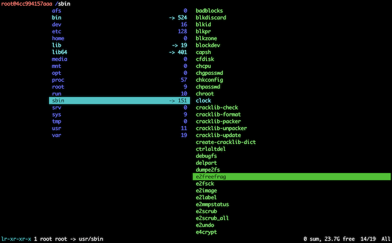

# Quick reference

- The official ranger docker image.

- Maintained by: [openEuler CloudNative SIG](https://gitee.com/openeuler/cloudnative).

- Where to get help: [openEuler CloudNative SIG](https://gitee.com/openeuler/cloudnative), [openEuler](https://gitee.com/openeuler/community).

# Apache ranger | openEuler
Current ranger docker images are built on the [openEuler](https://repo.openeuler.org/). This repository is free to use and exempted from per-user rate limits.

Ranger is a console file manager with VI key bindings. It provides a minimalistic and nice curses interface with a view on the directory hierarchy.

For more information about ranger, please visit [https://ranger.fm/](https://ranger.fm/).

# Supported tags and respective Dockerfile links
The tag of each ranger docker image is consist of the version of ranger and the version of basic image. The details are as follows
| Tags | Currently |  Architectures|
|--|--|--|
|[1.9.4-oe2403sp1](https://gitee.com/openeuler/openeuler-docker-images/blob/master/Bigdata/ranger/1.9.4/24.03-lts-sp1/Dockerfile)| Apache ranger 1.9.4 on openEuler 24.03-LTS-SP1 | amd64, arm64 |

# Usage

Users should start a ranger instance by following command:
```bash
docker run -it --name ranger openeuler/ranger:latest
```
After ranger started, your terminal will show such console file manager

 

# Question and answering
If you have any questions or want to use some special features, please submit an issue or a pull request on [openeuler-docker-images](https://gitee.com/openeuler/openeuler-docker-images).