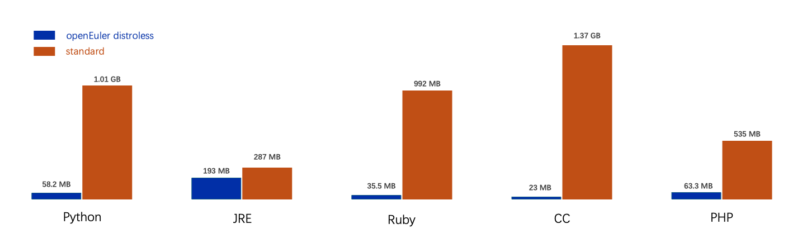

# 极简安全——openEuler Distroless镜像
---

### 引言
在云原生与容器化技术迅猛发展的今天，如何兼顾应用部署的**极致轻量化**与**高安全性**，成为开发者面临的核心挑战。openEuler社区正式发布Base、Static、CC、Ruby、Python、Node.js、PHP、JRE等Distroless镜像，通过“**零操作系统冗余**”的设计理念，为容器化应用提供**更小、更快、更安全**的运行时环境。


## 一、什么是Distroless？

Distroless镜像是**移除所有非必要组件**（如Shell、包管理器、系统工具）的极简容器镜像，仅保留应用运行所需的**最小依赖**。其核心价值在于：

- **安全加固**：无Shell和包管理器，攻击面减少
- **镜像瘦身**：相比传统镜像体积缩小50%~90%，更利于存储和传播


## 二、如何构建openEuler Distroless镜像

openEuler distroless镜像构建时，首先使用[splitter](https://gitee.com/openeuler/splitter)对RPM软件包进行切分处理，每个软件包会被切分成多个slices（每个slice包含一组具有特定功能的文件集合），软件包之间的依赖关系也更精细地表现为slice之间的依赖；然后以slice为最小构建单元生成最终的distroless镜像，可以有效减少冗余文件。


**1. 提交slice definition files**

SDF ([slice definition files](https://gitee.com/openeuler/slice-releases))定义了openEuler软件包切分成不同slice的规则（如上图中的`A.yaml`）。

目前，所有SDF均为手工生成，构建Distroless镜像之前，需要先在[slice-releases](https://gitee.com/openeuler/slice-releases)仓库的对应分支提交所有被用到的软件包的SDF文件。


**2. 使用EulerPublisher构建**

当[slice-releases](https://gitee.com/openeuler/slice-releases)对应的分支已经有构建目标distroless镜像的所有SDF之后，即可使用[EulerPublisher](https://gitee.com/openeuler/eulerpublisher)构建或直接发布目标镜像：
```
# 1. 构建openeuler/distroless-cc:latest镜像
eulerpublisher container distroless build -p openeuler/distroless-cc -t latest -f Distrofile

# 2. 一键构建发布openeuler/distroless-cc:latest镜像
eulerpublisher container distroless publish -p openeuler/distroless-cc -t latest -f Distrofile
```

Distrofile作为构建distroless镜像的输入，内容如下：
```
name: distroless-cc
summary: summary for `distroless-cc` image
base: scratch                                 # 构建distroless镜像时的基础镜像
release: 24.03-LTS                            # 以openEuler版本命名的slice分支
platforms:                                    # 目标distroless镜像的架构
  - linux/amd64
  - linux/arm64
parts:                                        # 构建目标镜像所需的所有slices
  - tzdata_base                               # slice名称由两部分组成：{软件包名}_{SDF文件中的slice名}
  - tzdata_zoneinfo
  - ca-certificates_static
  - libstdc++_libs
  - openssl-libs_libs
```

其中parts域段中的所有slice是以`{软件包名}_{SDF文件中的slice名}`命名，即`tzdata_base`表示使用`tzdata`软件包的`base`slice。

`base`slice的具体定义如下：
```
# tzdata.yml
package: tzdata

slices:
  base:
    contents:
      common:
        - /usr/share/zoneinfo/CET
        - /usr/share/zoneinfo/CST6CDT
        - /usr/share/zoneinfo/EET
        - /usr/share/zoneinfo/EST
        - /usr/share/zoneinfo/EST5EDT
        - /usr/share/zoneinfo/Factory
        - /usr/share/zoneinfo/HST
        - /usr/share/zoneinfo/MET
        - /usr/share/zoneinfo/MST
        - /usr/share/zoneinfo/MST7MDT
        - /usr/share/zoneinfo/PST8PDT
        - /usr/share/zoneinfo/WET
        - /usr/share/zoneinfo/iso3166.tab
        - /usr/share/zoneinfo/leapseconds
        - /usr/share/zoneinfo/tzdata.zi

  africa:
    deps:
      - tzdata_config
    contents:
      common:
        - /usr/share/zoneinfo/Africa/**

  ...
```

## 三、openEuler Distroless镜像说明

**1. openEuler社区正式发布多个语言类distroless镜像**
|                             **镜像**                               | **适用场景**              | **包含内容**                       |
|-------------------------------------------------------------------|--------------------------|-----------------------------------|
| [`static`](https://gitee.com/openeuler/openeuler-docker-images/blob/master/Distroless/distroless-static)  | 完全静态编译应用            | 零动态依赖，兼容任意Linux内核         |
| [`base`](https://gitee.com/openeuler/openeuler-docker-images/blob/master/Distroless/distroless-base)      | 自定义应用基础层            | 仅含glibc等核心库，支持静态链接       |
| [`cc`](https://gitee.com/openeuler/openeuler-docker-images/blob/master/Distroless/distroless-cc)          | C/C++原生应用              | 集成gcc运行时，免编译环境部署          |
| [`python`](https://gitee.com/openeuler/openeuler-docker-images/blob/master/Distroless/distroless-python)  | Python云函数/AI推理        | 保留pip及科学计算库，无冗余工具链     |
| [`nodejs`](https://gitee.com/openeuler/openeuler-docker-images/blob/master/Distroless/distroless-nodejs)  | Serverless前端/微服务      | 纯运行时无npm，防依赖注入攻击         |
| [`jre`](https://gitee.com/openeuler/openeuler-docker-images/blob/master/Distroless/distroless-jre)        | Java云原生应用（Spring等）  | 精简OpenJDK，无GUI/文档等非必要模块   |
| [`ruby`](https://gitee.com/openeuler/openeuler-docker-images/blob/master/Distroless/distroless-ruby)      | ruby原生应用               | 仅保留Ruby解释器及核心gem运行时       |
| [`php`](https://gitee.com/openeuler/openeuler-docker-images/blob/master/Distroless/distroless-php)        | php原生应用                | 保留PHP解释器、cli工具及其依赖的库     |

**2. openEuler Distroless镜像与标准镜像体积对比**




## 四、3步体验openEuler Distroless镜像
通常情况下，建议用户使用openEuler Distroless镜像作为运行时环境的基础镜像来使用，使用方法如下

**以Python镜像为例**：

**1. 编写Dockerfile** 
```
# dockerfile
FROM openeuler/distroless-python:3.11.6-oe2403lts
COPY app.py /app.py  
CMD ["/app.py"]  
```
**2. 构建镜像**  
```
docker build -t my-python-app .  
```

**3. 安全运行**
```
docker run --rm my-python-app
```
详细用法可参考[openEuler/openeuler-docker-images](https://gitee.com/openeuler/openeuler-docker-images)仓库下的**Distroless/distroless-{name}/example**内容。

## 五、立即获取
所有Distroless镜像已发布至Docker Hub, Quay, hub.oepkgs（中科院软件所）。以Distroless-python为例，获取方式如下:
```
# 从Docker Hub获取distroless-python
docker pull openeuler/distroless-python:3.11.6-oe2403lts

# 从Quay.io获取distroless-python
docker pull quay.io/openeuler/distroless-python:3.11.6-oe2403lts

# 从中科院软件所获取distroless-python
docker pull hub.oepkgs.net/openeuler/distroless-python:3.11.6-oe2403lts
```
由于国内访问Docker Hub受限，建议国内用户优先选择从从中科院软件所获取所有distroless镜像。