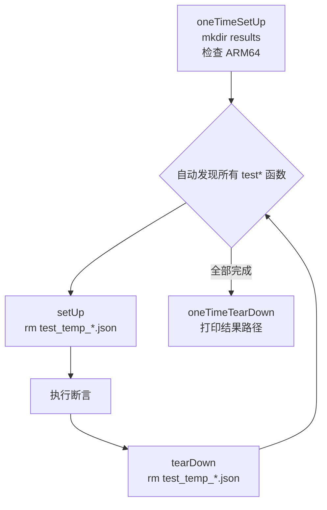
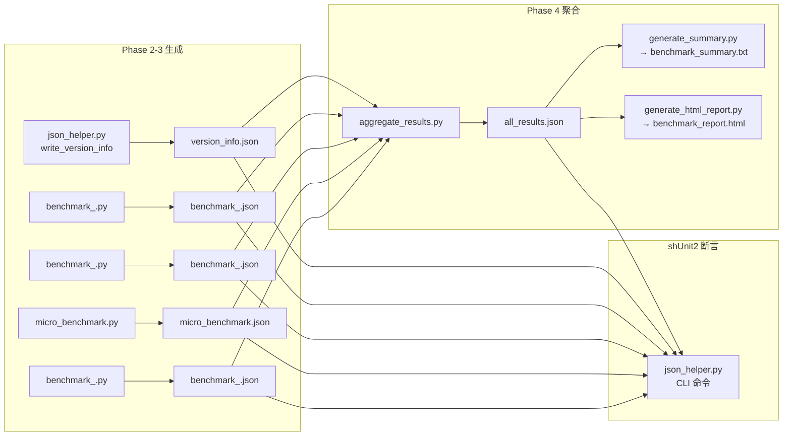

# ARM64 Performance Benchmark — 通用流程手册

> 本手册描述如何在 ARM64 (aarch64) 架构上对开源软件进行系统性性能基准测试。涵盖从环境准备到结果输出的完整流程，适用于所有类型的项目（数据库、数据处理、向量检索、嵌入式 KV 等）。各软件的具体差异在文中以 **[项目差异]** 标记说明。

---

## 目录

1. [项目总览](#1-项目总览)
2. [整体流程图](#2-整体流程图)
3. [Phase 1：环境准备与安装](#3-phase-1环境准备与安装)
4. [Phase 2：安装验证与版本信息收集](#4-phase-2安装验证与版本信息收集)
5. [Phase 3：基准测试执行](#5-phase-3基准测试执行)
6. [Phase 4：结果收集与展示](#6-phase-4结果收集与展示)
7. [shUnit2 测试验证体系](#7-shunit2-测试验证体系)
8. [JSON 数据流与文件结构](#8-json-数据流与文件结构)
9. [CLI 参数与使用方式](#9-cli-参数与使用方式)
10. [关键编码规则](#10-关键编码规则)
11. [各软件实例对照](#11-各软件实例对照)

---

## 1. 项目总览

### 目标

在 ARM64 平台上对开源软件进行 **工业标准级** 性能基准测试，产出可复现、可对比、可归档的量化结果。整个流程由 4 个 Phase + shUnit2 自动化测试验证构成，所有中间结果和最终结果以 JSON 格式存储，最终聚合为文本摘要和 HTML 报告。

### 项目文件结构

每个软件的基准测试项目遵循统一的目录结构：

```
<software>-arm64-benchmark/
├── <software>_arm64_perf_workflow.sh    # 主编排脚本 (4 Phase + CLI 入口)
├── <software>_arm64_perf_test.sh        # shUnit2 测试套件
├── shunit2                              # shUnit2 框架 (自动下载)
├── venv/                                # Python venv (PEP 668 兼容)
└── scripts/
    ├── json_helper.py                   # JSON 解析 CLI 工具 (9+ 命令)
    ├── verify_<lang>.<ext>              # 安装验证脚本
    ├── benchmark_<bench1>.py/sh/go      # 主基准测试 (如 YCSB、TPC-DS)
    ├── benchmark_<bench2>.py/sh/go      # 次基准测试 (如 吞吐量、Streaming)
    ├── micro_benchmark.py/sh/go         # 微基准 (单操作延迟/吞吐)
    ├── aggregate_results.py             # JSON 结果聚合
    ├── generate_summary.py              # 文本摘要生成
    └── generate_html_report.py          # HTML 报告 (纯 CSS + inline SVG)
└── results/
    ├── version_info.json                # Phase 2 输出
    ├── benchmark_<bench1>.json          # Phase 3a 输出
    ├── benchmark_<bench2>.json          # Phase 3b 输出
    ├── micro_benchmark.json             # Phase 3c 输出
    ├── benchmark_<bench3>.json          # Phase 3d 输出 (如有)
    ├── all_results.json                 # Phase 4 聚合
    ├── benchmark_summary.txt            # Phase 4 文本摘要
    ├── benchmark_report.html            # Phase 4 HTML 报告
    └── workflow.log                     # 全流程日志
```

**[项目差异]** 验证脚本的语言与目标软件一致：C 项目 (Redis, RocksDB) 用 Shell 脚本或 Python 调用二进制，Java 项目 (Flink) 内嵌于 Phase 2。

---

## 2. 整体流程图

```mermaid
flowchart TD
    START([🚀 workflow.sh main]) --> CLI{解析 CLI 参数<br/>-p / -s / -v / -d / -i / -t}

    CLI -->|test_only=1| TEST_ONLY[下载 shUnit2<br/>运行测试套件]
    CLI -->|test_only=0| P1

    subgraph P1["Phase 1: 环境准备与安装"]
        P1_1[1.1 架构验证<br/>uname -m = aarch64?] --> P1_2[1.2 安装系统依赖<br/>apt/yum/dnf]
        P1_2 --> P1_DEPS[1.3 安装运行时依赖<br/>JDK / Go / Python venv]
        P1_DEPS --> P1_4[1.4 下载目标软件<br/>4-5 mirror 回退]
        P1_4 --> P1_5[1.5 编译/安装<br/>make / pip / go build]
        P1_5 --> P1_6[1.6 启动服务 (如需要)<br/>或编译验证程序]
    end

    P1 --> P2

    subgraph P2["Phase 2: 安装验证与版本信息"]
        P2_1[2.1 基础功能测试<br/>PING / WordCount / verify] --> P2_2[2.2 收集版本信息<br/>json_helper.py write_version_info]
        P2_2 --> P2_3[2.3 运行安装验证脚本<br/>8-12 项检查]
    end

    P2 --> P3_DISPATCH{Phase 3 子阶段<br/>基于软件类别选择}

    P3_DISPATCH --> P3A[Phase 3a: 行业标准基准]
    P3_DISPATCH --> P3B[Phase 3b: 吞吐量/负载基准]
    P3_DISPATCH --> P3C[Phase 3c: 微基准]
    P3_DISPATCH --> P3D[Phase 3d: 压力/并发测试]

    P3A --> P4
    P3B --> P4
    P3C --> P4
    P3D --> P4

    subgraph P4["Phase 4: 结果收集与展示"]
        P4_0[停止服务 (如需要)] --> P4_1[聚合所有 JSON<br/>aggregate_results.py]
        P4_1 --> P4_2[生成文本摘要<br/>generate_summary.py]
        P4_2 --> P4_3[生成 HTML 报告<br/>generate_html_report.py<br/>纯 CSS + inline SVG]
    end

    P4 --> P4_OUT[/all_results.json<br/>benchmark_summary.txt<br/>benchmark_report.html/]
    P4_OUT --> TESTS

    TEST_ONLY --> TESTS

    subgraph TESTS["shUnit2 自动化测试验证"]
        OTSU[oneTimeSetUp<br/>创建 results 目录] --> LOOP{for each test*():}
        LOOP --> SU[setUp: 清理临时文件]
        SU --> EXEC[执行断言]
        EXEC --> TD[tearDown: 清理临时文件]
        TD --> LOOP
        LOOP -->|全部完成| OTSD[oneTimeTearDown<br/>打印结果路径]
    end

    OTSD --> END([✅ 流程完成])
```

---

## 3. Phase 1：环境准备与安装

Phase 1 是整个流程的起点，负责搭建 ARM64 测试环境并安装目标软件。所有后续 Phase 都依赖 Phase 1 的成功完成。

### 3.1 架构验证

**动作**：`uname -m` 检查当前架构是否为 `aarch64` 或 `arm64`。

**意义**：ARM64 基准测试必须在 ARM64 硬件上运行。在 x86_64 机器上误运行会导致编译失败或产生无效的测试数据（ARM64 模拟器结果不具代表性）。此检查作为硬性前置条件，非 ARM64 立即退出。

**通用代码**：
```bash
local arch="$(uname -m)"
if [ "${arch}" != "aarch64" ] && [ "${arch}" != "arm64" ]; then
    log "ERROR" "This benchmark requires ARM64. Current: ${arch}"
    return 1
fi
```

### 3.2 安装系统依赖

**动作**：根据操作系统类型（Debian/Ubuntu、RHEL/CentOS、macOS）安装基础构建工具：gcc/g++、cmake、make、wget、curl、python3 等。

**意义**：不同 Linux 发行版的包管理器不同。统一检测 `apt-get`/`yum`/`dnf`/`brew` 并安装基础依赖，确保后续编译和 Python venv 创建能顺利进行。

**[项目差异]**：
| 软件 | 需额外安装的系统包 |
|----------|-------------------|
| Flink | 无特殊，JDK 通过 Temurin 单独安装 |
| Redis | `libssl-dev` / `openssl-devel` |
| RocksDB | `libgflags-dev`, `libsnappy-dev`, `liblz4-dev`, `zlib1g-dev`, `libzstd-dev`, `libjemalloc-dev`, `libbz2-dev`, `liburing-dev` (压缩/过滤器/io_uring 依赖) |

### 3.3 安装运行时依赖

**动作**：安装目标软件运行所需的特定依赖。

**意义**：不同语言生态需要不同的运行时环境。这是 **项目间差异最大** 的步骤。

**[项目差异]**：

| 软件 | 运行时 | 安装方式 | 关键细节 |
|------|--------|----------|----------|
| Flink | JDK 21 | Eclipse Temurin (Adoptium) ARM64 | 检查 `temurin.list` 是否已存在避免重复 apt 源 |
| Redis | 无额外运行时 (C 编译) | `make` | 依赖 `libssl-dev` |
| RocksDB | 无额外运行时 (C++ 编译) | `make db_bench` | `USE_JEMALLOC=1`, `-march=armv8-a+crc+crypto` ARM64 优化 |

Python venv 创建的标准模式：
```bash
python3 -m venv "${SCRIPT_DIR}/venv"
"${SCRIPT_DIR}/venv/bin/pip" install --quiet --upgrade pip
"${SCRIPT_DIR}/venv/bin/pip" install --quiet numpy pandas scipy matplotlib
export PATH="${SCRIPT_DIR}/venv/bin:${PATH}"
```

> **为什么必须 venv**：Debian/Ubuntu 23.04+ 实施了 PEP 668，`python3 -m pip install` 会报 `externally-managed-environment` 错误。venv 是唯一的合规安装方式。所有后续 Python 调用都使用 venv 中的 `python3`。

### 3.4 下载目标软件

**动作**：从多个镜像站点下载目标软件源码/二进制包，使用 wget 和 curl 双通道回退。

**意义**：许多 aarch64 测试机器（尤其在中国/企业环境）无法访问 `archive.apache.org` 或 `github.com`（SSL/网络限制）。4-5 个镜像 + wget/curl 双通道确保在绝大多数网络环境下都能成功下载。每次下载后验证 gzip 格式（`file | grep gzip`），防止下载到 HTML 错误页面。

**通用下载模式**：
```bash
local mirrors=(
    "https://archive.apache.org/dist/..."     # 官方
    "https://mirrors.aliyun.com/..."           # 阿里云
    "https://mirrors.tuna.tsinghua.edu.cn/..." # 清华
    "https://mirrors.huaweicloud.com/..."      # 华为云
    "https://repo.huaweicloud.com/..."         # 华为仓库
)
# wget 通道 → 失败 → curl 通道 → 失败 → 手动下载提示
```

**[项目差异]**：
| 软件 | 主要下载源 | 镜像配置 |
|------|-----------|---------|
| Flink | Apache 官方 + 4 阿里云/清华/华为镜像 | `.tgz` gzip 包 |
| Redis | GitHub Releases + ghproxy CDN | `.tar.gz` 源码包 |
| RocksDB | GitHub git clone + fastgit/gitclone 镜像 | `git clone --depth=1 --branch=v<VERSION>` |

### 3.5 编译/安装

**动作**：将下载的源码编译为可执行程序，或通过包管理器安装。

**意义**：确保目标软件在 ARM64 平台上可以正常编译和运行。编译参数需要针对 ARM64 优化。

**[项目差异]**：
| 软件 | 编译方式 | ARM64 关键参数 |
|------|----------|---------------|
| Redis | `make -j $(nproc)` | 无特殊，Redis 原生支持 ARM64 |
| RocksDB | `make -j $(nproc) db_bench` | `OPT="-O2 -march=armv8-a+crc+crypto"`, `PORTABLE=1`, `USE_JEMALLOC=1` |
| Flink | 无需编译，预编译包直接部署 | Temurin JDK 21 ARM64 |

> **为什么 `make -j 4` 而不是 `make -j $(nproc)`**：部分 ARM64 构建机器内存有限（4-8GB），`$(nproc)` 可能返回 32-64 个核心，全并行编译会导致 OOM。`-j 4` 是安全的折中值。

> **RocksDB 的 ARM64 优化**：编译时使用 `-march=armv8-a+crc+crypto` 启用 ARM64 CRC32C 硬件加速指令（`crc32c_arm64.cc`），RocksDB 的校验和计算在 ARM64 上比 x86_64 SSE 更快。`USE_JEMALLOC=1` 启用 jemalloc 内存分配器以减少碎片。

### 3.6 启动服务或验证程序

**动作**：启动目标软件的服务进程（如果是服务型软件），或运行编译后的验证程序。

**意义**：服务型软件需要在运行状态下才能进行基准测试；嵌入式库/工具型软件则验证编译产物可用。

**[项目差异]**：

| 软件 | Phase 1 结束时的状态 | 说明 |
|----------|---------------------|------|
| Flink | 集群配置完成（未启动） | Phase 2 启动集群验证 |
| Redis | 服务已启动并监听 port=6380 | daemonize=yes, maxmemory=512mb |
| RocksDB | `db_bench` 编译完成 | 嵌入式引擎，无独立服务进程 |

---

## 4. Phase 2：安装验证与版本信息收集

Phase 2 确认 Phase 1 的安装结果正确，并收集完整的软硬件环境信息作为测试报告的元数据。

### 4.1 基础功能测试

**动作**：执行目标软件的最简单命令，确认其响应正常。

**意义**：这是"冒烟测试"。如果软件连最基本的命令都无法执行，后续所有基准测试都不可信。

**[项目差异]**：
| 软件 | 冒烟测试命令 | 预期结果 |
|------|-------------|---------|
| Redis | `redis-cli PING` | `PONG` |
| Flink | `flink run WordCount.jar` | 作业成功完成 |
| RocksDB | `db_bench --help` | 输出使用说明，确认二进制可用 |

### 4.2 收集版本信息

**动作**：收集 7+ 个软硬件属性，通过 `json_helper.py write_version_info` 写入 `version_info.json`。

**意义**：版本信息是基准测试报告的**核心元数据**。没有环境信息的测试结果无法复现、无法横向对比。所有影响性能的硬件和软件因素都必须记录。

**必收集字段**：

| 字段 | 来源 | 说明 |
|------|------|------|
| `timestamp` | `date -u` | UTC 时间戳，确保跨时区可比 |
| `architecture` | `uname -m` | aarch64/arm64 |
| `kernel` | `uname -r` | 内核版本影响调度器和内存管理 |
| `os` | `/etc/os-release` PRETTY_NAME | 操作系统版本 |
| `cpu_model` | `/proc/cpuinfo` model_name 或 CPU part | ARM64 无 `model name`，用 `CPU part`（十六进制如 `0xd01`） |
| `cpu_cores` | `nproc` | 并行度配置依据 |
| `memory_mb` | `/proc/meminfo` MemTotal | 内存容量影响 GC/OOM |
| `software_version` | 用户参数或软件自身输出 | 目标软件版本 |
| `runtime_version` | java -version / go version / python3 --version | 运行时版本 |
| `install_path` | 安装目录 | 软件安装位置 |

**[项目差异]**：
| 软件 | 额外字段 |
|------|---------|
| Flink | `scala_version`, `flink_home`, `task_slots`, `parallelism` |
| Redis | `gcc_version` (编译工具链) |
| RocksDB | `arm64_crc32c_source_exists` (CRC32C 硬件加速检测), `neon_asimd_support` (NEON/ASIMD), `jemalloc_enabled` (内存分配器), `compression_algorithms` (可用压缩算法列表) |

> **ARM64 `/proc/cpuinfo` 差异**：x86_64 有 `model name` 字段（如 "Intel Xeon E5-2680"），ARM64 只有 `CPU part` 字段（十六进制如 `0xd01`），且不同厂商格式不同。`safe_int()` 函数需要处理十六进制字符串。

> **控制字符清洗**：所有 shell 变量传入 `json_helper.py` 前必须 `tr -d '\n\t'` 去除控制字符。`java -version` 输出到 stderr 且含换行，`/proc/cpuinfo` 可能含多余空白。未经清洗的变量会导致 JSON 解析失败。

### 4.3 运行安装验证脚本

**动作**：执行专门的验证脚本，逐项检查安装完整性。

**意义**：系统化验证所有关键组件的存在性和功能性，比单一冒烟测试更全面。验证脚本通常检查 8-12 项内容。

**[项目差异]**：
| 软件 | 验证脚本 | 检查项数 | 关键检查 |
|------|---------|---------|---------|
| Redis | `verify_c.sh` (Shell) | 8 | redis-server/cli/benchmark 可执行、PING→PONG、SET/GET 功能、INFO server |
| RocksDB | `verify_rocksdb.py` (Python) | 6+ | db_bench 可执行、版本号、ARM64 CRC32C 源码存在、NEON/ASIMD 支持、压缩算法可用性 |
| Flink | 内嵌于 Phase 2 | 3 | WordCount 作业、集群启动、版本号 |

> **验证脚本绝不 `exit 1`**：即使部分检查项失败，验证脚本也只输出 WARNING 并继续，最终 `version_info.json` 必须写入。否则后续 Phase 3/4 不执行，shUnit2 测试全部报告"文件不存在"失败。

---

## 5. Phase 3：基准测试执行

Phase 3 是核心测试阶段，根据软件类别分为 4 个子阶段（3a/3b/3c/3d）。每个子阶段产出独立的 JSON 结果文件。

### 5.1 子阶段选择矩阵

不同软件类别使用不同的基准测试组合：

| 软件类别 | Phase 3a | Phase 3b | Phase 3c | Phase 3d |
|----------|----------|----------|----------|----------|
| **数据处理** (Flink) | TPC-DS SQL 查询 | Streaming 吞吐/延迟 | 微操作 (window/join/sort) | State 后端 & Checkpoint |
| **KV 存储** (Redis, RocksDB) | YCSB (A/B/C/D 工作负载) | 吞吐量 (多操作×多并发) / db_bench Compaction | 微基准 (单命令延迟+分布) | 压力测试 (并发扩展) |

### 5.2 Phase 3a：行业标准基准

**动作**：运行该软件领域公认的行业基准测试套件。

**意义**：行业基准是跨软件、跨平台横向对比的**唯一可信依据**。TPC-DS 是数据处理的 ISO 标准测量方法；YCSB 是 KV 存储的学术标准；ANN Benchmarks 是向量检索的社区标准。

**[项目差异]**：

| 软件 | 行业基准 | 测试内容 | 迭代 |
|------|---------|---------|------|
| Flink | TPC-DS | 6-10 条 SQL 查询 (q1/q2/q3/q7/q14/q18)，测 elapsed_sec + records | 3 iter |
| Redis | YCSB | 4 种工作负载：A(50/50) B(95/5) C(100/0) D(95/5)，测 throughput + p99 latency | 3 iter × 4 workload |
| RocksDB | YCSB | Workload A (update-heavy) + Workload C (read-only)，测 throughput_ops_sec + p99 latency | 3 iter |

> **Flink TPC-DS 的特殊处理**：Flink 2.x SQL Client 输出使用 **tableau 格式**（无 `|` 或 `+---+` 边框），旧格式解析会返回 `records=0`。`parse_sql_client_output()` 使用 border→tableau→regex 三级回退链。

> **Redis YCSB 的数据流**：先生成 N 条 Hash 记录 → `redis-cli --pipe` 批量加载 → 运行 4 种工作负载 → 每种结束后 `FLUSHDB` 清理。

> **RocksDB YCSB 的数据流**：使用 `db_bench` 内置的 YCSB 模式，通过 `--benchmarks=fillseq,readrandom,overwrite` 等参数模拟 YCSB 工作负载。

### 5.3 Phase 3b：吞吐量/负载基准

**动作**：在多种操作类型和并发级别下测量吞吐量。

**意义**：行业基准关注宏观表现，吞吐量基准关注**具体操作**在不同负载下的表现。这是生产环境调优的直接依据。

**[项目差异]**：

| 软件 | 测试内容 | 维度 |
|------|---------|------|
| Redis | 10 种操作 × 4 并发级别 × 3 iter | GET/SET/MGET/HSET/HGETALL/LPUSH/LRANGE/SADD/ZADD/PING × 1/10/50/100 clients |
| Flink | Streaming 吞吐 + WordCount | records_per_sec + avg_latency_ms |
| RocksDB | db_bench Compaction & Filter 基准 | 3 种 Compaction 风格 (level/universal/fifo) × 压缩算法 × Bloom/Ribbon 过滤器 |

### 5.4 Phase 3c：微基准

**动作**：测量单个操作/组件的延迟和吞吐，通常在最小负载下运行。

**意义**：微基准揭示**最底层**的性能特征。当宏观基准发现瓶颈时，微基准可以精确定位是哪个操作导致了问题。同时微基准的结果更稳定、可复现，适合跨版本纵向对比。

**[项目差异]**：

| 软件 | 微操作列表 | 特殊维度 |
|------|-----------|---------|
| Redis | 16 种单命令 | 延迟分布 (p50/p90/p99/p999)，并发扩展 (1→200 clients) |
| Flink | window_aggregate / join / sort / filter | changelog 行计数 (+I[行]) |
| RocksDB | write/read/delete/mixed 操作 + CRC32C vs xxHash | ARM64 CRC32C 硬件加速对比软件 xxHash |

### 5.5 Phase 3d：压力/并发测试

**动作**：在极端并发条件下测试系统稳定性和性能退化。

**意义**：生产环境不会只跑 1 个客户端。压力测试回答"当负载从 1 增长到 200 时，吞吐量是线性增长还是饱和？延迟是平稳还是急剧上升？"

**[项目差异]**：

| 软件 | 压力测试内容 | 并发范围 |
|------|-------------|---------|
| Redis | 7 并发 × 3 iter (micro_benchmark.py --stress-only) | 1/5/10/20/50/100/200 clients |
| Flink | State backend checkpoint | checkpoint 大小和恢复时间 |
| RocksDB | 多线程 fillseq/readrandom (16 threads 默认) | 可通过 `--threads` 参数调整 |

### 5.6 Phase 3 的服务生命周期

**动作**：部分软件需要在 Phase 3 前后管理服务进程。

**[项目差异]**：
| 软件 | Phase 3 前 | Phase 3 后 | 说明 |
|------|-----------|-----------|------|
| Flink | `start-cluster.sh` | `stop-cluster.sh` | Phase 2 已停止集群，Phase 3 必须重新启动 |
| Redis | 服务已在 Phase 1 启动 | Phase 4 停止 | Redis 持续运行，Phase 3 不需要重启 |
| RocksDB | 无服务 | 无服务 | 嵌入式引擎，db_bench 自包含 |

> **Flink 的关键 bug 模式**：Phase 2 中 `stop-cluster.sh` 停止了集群，如果 Phase 3 不重新 `start-cluster.sh`，所有 benchmark 调用会失败。这是最常见的集成错误。

---

## 6. Phase 4：结果收集与展示

Phase 4 将所有分散的 JSON 结果整合为统一输出，生成人类可读的摘要和可视化报告。

### 6.1 停止服务

**动作**：如果目标软件是服务型，先优雅停止。

**意义**：确保基准测试期间的服务进程不会干扰结果聚合，释放端口和内存。使用 `SHUTDOWN NOSAVE` 优雅停止，`kill -9` 作为兜底。

**[项目差异]**：嵌入式引擎型软件（RocksDB）无需此步骤。

### 6.2 聚合所有 JSON

**动作**：`aggregate_results.py` 读取 `version_info.json` + 所有 benchmark JSON，合并为 `all_results.json`。

**意义**：分散的 JSON 文件不便对比和归档。聚合文件包含完整的测试上下文：环境信息 + 所有基准测试结果 + 统计摘要（avg/max/min）。

**聚合后的 JSON 结构**：
```json
{
  "version_info": { ... },
  "primary_benchmark": { ... },
  "secondary_benchmark": { ... },
  "micro_benchmark": { ... },
  "stress_benchmark": { ... },
  "summary": {
    "avg_throughput": ...,
    "max_latency": ...,
    "test_timestamp": ...
  }
}
```

### 6.3 生成文本摘要

**动作**：`generate_summary.py` 读取 `all_results.json`，输出 `benchmark_summary.txt`。

**意义**：纯文本摘要适合终端查看、日志系统和 CI 流水线输出。包含关键指标的表格化展示。

### 6.4 生成 HTML 报告

**动作**：`generate_html_report.py` 生成 `benchmark_report.html`，包含 4 个 inline SVG 图表 + 4 个数据表 + 环境信息 + metrics 卡片。

**意义**：HTML 报告是最终交付物，适合归档、分享和演示。纯 CSS + inline SVG 确保无外部 JS 依赖，单文件即可完整展示。

**HTML 报告必含内容**：
1. Header：软件名、版本、时间戳
2. 环境信息表：arch/kernel/CPU/mem/runtime
3. Metrics 卡片（grid 布局）：吞吐量/延迟/QPS/Recall
4. SVG 柱状图：吞吐量对比
5. SVG 柱状图：p99 延迟对比
6. 数据表：详细结果 + 状态指示
7. 基准测试描述 + 行业参考链接
8. shUnit2 测试结果摘要

---

## 7. shUnit2 测试验证体系

shUnit2 是整个基准测试流程的**质量保障层**。每个 benchmark 项目都配备独立的 shUnit2 测试套件，对每个 Phase 的输出进行断言验证。

### 7.1 测试生命周期



| 函数 | 调用时机 | 用途 |
|------|---------|------|
| `oneTimeSetUp` | 测试开始前 | 创建 results 目录，检查 ARM64 |
| `setUp` | 每个 test 前 | 清理临时文件，重置状态 |
| `tearDown` | 每个 test 后 | 清理临时文件 |
| `oneTimeTearDown` | 测试结束后 | 打印结果路径，汇总信息 |

### 7.2 测试项分类与含义

所有项目的测试项遵循统一的分类体系，具体内容因软件而异：

#### 7.2.1 Phase 2 验证测试（7-9 项）

这些测试断言 Phase 2 的输出正确：

| 测试函数模式 | 含义 | 失败意味着 |
|-------------|------|-----------|
| `testArchitectureIsARM64` | 当前机器是 ARM64 | 在错误架构上运行，所有结果无效 |
| `test<Software>IsInstalled` | 软件已安装/目录存在 | Phase 1 安装失败 |
| `test<Software>BinaryExists` | 主二进制可执行 | 编译失败或路径错误 |
| `test<Software>CliBinaryExists` | CLI 工具可执行 | 安装不完整 |
| `test<Software>VersionMatches` | 版本号匹配预期 | 版本不一致，结果不可比 |
| `test<Software>RunsBasicCommand` | 基础命令成功执行 | 软件无法运行 |
| `testVersionInfoJSONExists` | version_info.json 文件存在 | Phase 2 未执行 |
| `testVersionInfoHasRequiredFields` | version_info.json 有必填字段 | JSON 写入不完整 |
| `testVersionInfoHasArchitecture` | architecture 字段为 aarch64 | 环境信息记录错误 |

**[项目差异]**：

| 软件 | 额外验证测试 |
|------|-------------|
| Flink | `testJavaIsInstalled` (JDK 检查), `testFlinkStartsCluster` (集群启动), `testFlinkWordCountSucceeds` (作业执行) |
| Redis | `testRedisBenchmarkBinaryExists` (redis-benchmark), `testRedisServerResponsive` (PING→PONG) |
| RocksDB | `testRocksdbRunsBasicCommand` (db_bench --help), `testArm64CRC32CDetected` (ARM64 CRC32C 硬件加速检测) |

#### 7.2.2 Phase 3a 基准测试（2-4 项）

| 测试函数模式 | 含义 | 失败意味着 |
|-------------|------|-----------|
| `testBenchmark<Primary>ProducesResults` | 行业基准 JSON 文件存在 | Phase 3a 未执行或崩溃 |
| `testBenchmark<Primary>HasRequiredFields` | JSON 有 benchmark/metrics/results 字段 | 脚本输出格式错误 |
| `testBenchmark<Primary>ThroughputAboveThreshold` | 吞吐量 ≥ 最低阈值 | 性能严重低于预期或 JSON 路径错误 |
| `testBenchmark<Primary>LatencyBelowThreshold` | 延迟 ≤ 最大阈值 | 性能严重低于预期 |

**[项目差异]**：

| 软件 | 3a 测试的特殊断言 |
|------|-------------------|
| Redis | YCSB: throughput ≥ 1000 ops/sec, p99 read latency ≤ 50ms |
| Flink | TPC-DS: `testBenchmarkTpcdsQueriesExecuted` (raw_count ≥ 1，不检查吞吐量阈值，因为 SQL 查询重在"是否执行成功") |
| RocksDB | YCSB: `testYCSBWorkloadAThroughputAboveThreshold` (≥ 100 ops/sec), `testYCSBWorkloadCReadOnlyThroughput` (≥ 100 ops/sec) |

#### 7.2.3 Phase 3b 吞吐量测试（2-3 项）

| 测试函数模式 | 含义 |
|-------------|------|
| `testBenchmark<Secondary>ProducesResults` | 吞吐量 JSON 文件存在 |
| `testBenchmark<Secondary>HasRequiredFields` | JSON 结构完整 |
| `testBenchmark<Secondary>ThroughputAboveThreshold` | 关键操作吞吐量 ≥ 阈值 |

**[项目差异]**：

| 软件 | 3b 测试内容 |
|------|------------|
| Redis | GET ≥ 5000 ops/sec, SET ≥ 3000 ops/sec (两个独立断言) |
| Flink | Streaming avg latency ≤ 5000ms |
| RocksDB | `testDbBenchCompactionStylesValid` (level/universal compaction), `testDbBenchCompressionValid` (压缩算法), `testDbBenchFiltersValid` (Bloom/Ribbon 过滤器) |

#### 7.2.4 Phase 3c 微基准测试（2-3 项）

| 测试函数模式 | 含义 |
|-------------|------|
| `testBenchmarkMicroProducesResults` | 微基准 JSON 存在 |
| `testBenchmarkMicroAllOperationsCompleted` | 结果数 > 0 |
| `testBenchmarkMicroLatencyBelowThreshold` | 关键操作延迟 ≤ 阈值 |

**[项目差异]**：

| 软件 | 3c 特殊断言 |
|------|------------|
| Redis | 16 种操作全部完成, GET p99 latency ≤ 50ms |
| Flink | ≥ 4 种微操作 (window/join/sort/filter), count_results > 0 |
| RocksDB | `testMicroBenchmarkAllCategoriesPresent` (write/read/delete/mixed/hash_checksum 5 类), `testMicroCRC32CARM64Performance` (CRC32C vs xxHash 对比) |

#### 7.2.5 Phase 3d 压力测试（1-2 项）

| 测试函数模式 | 含义 |
|-------------|------|
| `testBenchmarkStressProducesResults` | 压力测试 JSON 存在 |
| `testBenchmarkStressScalingShowsProgression` | 多并发级别结果数 ≥ 3 |

**[项目差异]**：RocksDB 无独立 3d 子阶段（db_bench 的并发参数在 3a/3c 中已覆盖），Flink 的 3d 是 State backend checkpoint。

#### 7.2.6 Phase 4 报告测试（4 项 — 所有项目通用）

| 测试函数 | 含义 | 失败意味着 |
|---------|------|-----------|
| `testAggregatedResultsExist` | `all_results.json` 存在 | Phase 4 聚合未执行 |
| `testHtmlReportGenerated` | `benchmark_report.html` 存在 | HTML 生成失败 |
| `testSummaryReportGenerated` | `benchmark_summary.txt` 存在 | 摘要生成失败 |
| `testAggregatedResultsContainsAllBenchmarks` | 聚合文件含所有基准关键词 | 聚合脚本遗漏某个 benchmark |

### 7.3 json_helper.py 断言桥梁

shUnit2 是 Shell 测试框架，无法直接解析 JSON。`json_helper.py` 作为**桥梁工具**，提供 CLI 命令让 Shell 断言 JSON 内容：

| 命令 | 用途 | shUnit2 用法 |
|------|------|-------------|
| `get <keys>` | 获取嵌套值 | `actual="$(json_get ...)"` → `assertEquals` |
| `field_exists <key>` | 字段是否存在 (返回 1/0) | `assertTrue "[ $(json_field_exists ...) -eq 1 ]"` |
| `count_results` | results 数组长度 | `assertTrue "[ $(json_count_results ...) -gt 0 ]"` |
| `throughput_ge <threshold> <keys>` | 值 ≥ 阈值 (返回 1/0) | `assertTrue "[ $(json_throughput_ge ...) -eq 1 ]"` |
| `latency_le <threshold> <keys>` | 值 ≤ 阈值 (返回 1/0) | `assertTrue "[ $(json_latency_le ...) -eq 1 ]"` |
| `version` | 获取软件版本 | `assertEquals "${EXPECTED}" "$(json_version ...)"` |
| `contains <keyword>` | JSON 文本含关键词 | `assertTrue "[ $(json_contains ...) -eq 1 ]"` |
| `write_version_info <args>` | 写入 version_info.json | Phase 2 调用，不用作断言 |

Shell 包装函数的标准模式：
```bash
json_get()              { python3 "${JSON_HELPER}" "$1" get "${@:2}"; }
json_throughput_ge()    { python3 "${JSON_HELPER}" "$1" throughput_ge "$2" "${@:3}"; }
json_latency_le()       { python3 "${JSON_HELPER}" "$1" latency_le "$2" "${@:3}"; }
```

> **为什么用 `"${@:3}"` 而不是 `"$3" "$4"`**：JSON 路径可以是任意深度（如 `results 0 avg_latency_ms` 是 3 个 key），硬编码 2 个 key 会截断深层路径，返回 `NULL` 或 0。

### 7.4 startSkipping 机制

当前置数据不存在时（如 `-t` test-only 模式在安装前运行），硬断言会导致测试失败和非零退出码。`startSkipping` 让当前测试标记为 SKIP 而不是 FAIL：

```bash
testBenchmarkYCSBProducesResults() {
    local bench_file="${RESULTS_DIR}/benchmark_ycsb.json"
    if [ ! -f "${bench_file}" ]; then
        startSkipping
        return
    fi
    assertTrue "YCSB JSON should exist" "[ -f '${bench_file}' ]"
}
```

**何时使用**：
- 所有依赖 Phase 输出文件的测试：文件不存在 → skip
- 依赖软件二进制的测试：二进制不存在 → skip（不是 fail）
- 阈值测试：值获取失败（NULL/空） → skip

---

## 8. JSON 数据流与文件结构

### 8.1 JSON 生成与消费关系



### 8.2 基准测试 JSON 标准格式

每个 benchmark JSON 必须遵循此结构：

```json
{
  "benchmark": "<benchmark_name>",
  "description": "What this test measures",
  "reference": "Industry source URL or project name",
  "timestamp": "2025-...",
  "performance_metrics": {
    "<metric_name>": {
      "unit": "<unit>",
      "description": "<what this metric means>"
    }
  },
  "dataset_info": {
    "name": "<dataset>",
    "size": "<size>",
    "source": "<where data comes from>"
  },
  "results": [ ... ]
}
```

**[项目差异]**：

| 软件 | JSON 特殊字段 |
|------|-------------|
| Redis 吞吐量 | 顶层 `throughput_get` / `throughput_set` scalar 字段（供 shUnit2 直接断言） |
| Flink TPC-DS | `raw_results` 数组（每条查询详情） + `summary`（聚合统计） |
| RocksDB YCSB | `results.ycsb_workload_a_update_heavy.run_throughput_ops_sec`（嵌套路径） |
| RocksDB db_bench | `compaction_styles` / `compression_algorithms` / `bloom_ribbon_filters`（三类对比数据） |
| RocksDB micro | `results.write_operations` / `read_operations` / `delete_operations` / `mixed_operations` / `hash_checksum`（5 类操作） |

---

## 9. CLI 参数与使用方式

### 9.1 通用 CLI 参数

所有项目的 workflow 脚本支持以下参数：

| 参数 | 长选项 | 默认值 | 说明 |
|------|--------|--------|------|
| `-p` | `--phases` | `1,2,3,4` | 指定执行的 Phase（逗号分隔） |
| `-s` | `--software-version` | 软件特定 | 目标软件版本号 |
| `-v` | `--data-scale` | 1 | 数据规模因子 |
| `-d` | `--data-size` | 软件特定 | 微基准数据量 |
| `-i` | `--iterations` | 3 | 每项测试迭代次数 |
| `-t` | `--test-only` | (flag) | 仅运行 shUnit2 测试验证 |
| `-h` | `--help` | (flag) | 显示帮助信息 |

**[项目差异]**：部分软件有额外参数：

| 软件 | 额外参数 | 说明 |
|------|---------|------|
| RocksDB | `-n --num-keys`, `-V --value-size`, `-t --threads` | 键数量、值大小(bytes)、线程数 |
| Redis | 无额外参数 | — |
| Flink | 无额外参数 | — |

### 9.2 使用示例

```bash
# 全流程运行
./<software>_arm64_perf_workflow.sh

# 仅运行特定 Phase
./flink_arm64_perf_workflow.sh -p 3a,3b          # 只跑 TPC-DS + Streaming
./redis_arm64_perf_workflow.sh -p 3a,3c           # 只跑 YCSB + 微基准
./rocksdb_arm64_perf_workflow.sh -p 3a             # 只跑 YCSB

# 仅运行测试验证（不执行基准测试）
./<software>_arm64_perf_workflow.sh -t

# 自定义参数
./redis_arm64_perf_workflow.sh -i 5 -d 5000000    # 5 次迭代, 5M 记录
./rocksdb_arm64_perf_workflow.sh -n 5000000 -V 512 -t 32  # 5M 键, 512字节值, 32线程

# 指定版本
./flink_arm64_perf_workflow.sh -s 2.0.0
./rocksdb_arm64_perf_workflow.sh -s 8.9.1
```

### 9.3 执行顺序

`-t` (test-only) 跳过所有 Phase，只下载 shUnit2 并运行测试套件。非 `-t` 模式先执行所有 Phase，再运行测试套件。

---

## 10. 关键编码规则

以下是经过多个项目实践验证的编码规则，违反这些规则会导致已知 bug 模式：

### 规则 1：禁止 shell 内嵌多行 Python

**`python3 -c "..."` 在 shell 中严禁使用**。Shell 双引号与 Python 字符串冲突，多行字符串在 shell 中格式化不可控。

**替代方案**：所有 Python 逻辑放入 `scripts/` 目录的独立 `.py` 文件，通过 CLI 参数调用。

### 规则 2：禁止 shell heredoc 写 JSON

**`cat << EOFJSON` 严禁用于生成 JSON 文件**。Shell 变量（cpu_model, java_ver）可能含控制字符（`\n`, `\t`），导致 `JSONDecodeError: Invalid control character`。

**替代方案**：使用 `json_helper.py write_version_info` 命令，内部使用 `json.dump()` 自动转义。

### 规则 3：PEP 668 — venv 优先

**Debian/Ubuntu 23.04+ 禁止 `pip install` 系统级安装**。必须先 `python3 -m venv`，再 `venv/bin/pip install`。所有后续 `python3` 调用通过 venv PATH。

### 规则 4：多镜像下载回退

**所有软件下载必须配置 4-5 个镜像 + wget/curl 双通道**。单个镜像源在 aarch64 环境（尤其中国/企业网络）不可靠。下载后必须用 `file | grep gzip` 验证格式。

### 规则 5：Shell 变量清洗

**所有传入 `json_helper.py` 的 shell 变量必须 `tr -d '\n\t'`**。`java -version` 输出到 stderr 含换行，`/proc/cpuinfo` 含多余空白。

### 规则 6：Shell 包装函数使用 `${@:2}` / `${@:3}`

**JSON 路径可以是任意深度**。硬编码 `"$3" "$4"` 只传 2 个 key，深层路径被截断返回 `NULL`。

### 规则 7：JSON 路径与实际结构一致

**断言中的 JSON 路径必须与 benchmark 脚本实际输出的结构匹配**。常见错误：把 scalar 当 dict 访问、把 list 当 dict 访问（缺少 index）。

### 规则 8：`-t` 短选项不碰撞

**`-t` 只用于 `--test-only`（布尔 flag）**，不能同时作为 `--terminals`（需 `$2`）的短选项。`set -euo pipefail` 下未绑定 `$2` 导致 `unbound variable` 错误。

### 规则 9：`startSkipping` 而非硬断言

**当前置数据缺失时使用 `startSkipping`**，而不是 `assertTrue` 硬断言。`-t` 模式在安装前运行测试时，文件不存在是预期行为。

### 规则 10：sed 使用 `|` 或 `#` 分隔符

**替换含 `/` 的路径字符串时**，`sed "s/.../path/"` 中 `/` 冲突。使用 `sed "s|^dir .*|dir ${RESULTS_DIR}|"`。

### 规则 11：验证脚本不 `exit 1`

**验证脚本的检查项失败只输出 WARNING**，继续执行后续检查和 `write_version_info`。`exit 1` 会阻止 Phase 3/4 执行。

### 规则 12：默认参数设为快速验证值

**默认 iterations=1, 数据量小, 阈值宽松**。生产运行通过 CLI 参数覆盖。快速验证模式确保 `-t` 在任何环境下都能通过。

### 规则 13：每个阈值测试含 `[DIAG]` 输出

**阈值断言前先 echo 实际值**。失败时诊断信息显示值是 `NULL`（路径错误）还是真实数字低于阈值。

---

## 11. 各软件实例对照

### 11.1 测试项数量对照

| 软件 | Phase 2 测试 | Phase 3a 测试 | Phase 3b 测试 | Phase 3c 测试 | Phase 3d 测试 | Phase 4 测试 | 总计 |
|------|-------------|-------------|-------------|-------------|-------------|-------------|------|
| Flink | 9 | 3 | 2 | 2 | 1 | 4 | 21 |
| Redis | 7 | 4 | 4 | 3 | 1 | 4 | 22 |
| RocksDB | 6 | 4 | 3 | 3 | 0 | 4 | 20 |

### 11.2 Phase 3 子阶段对照

| 软件 | 3a | 3b | 3c | 3d | 子阶段数 |
|------|----|----|----|----|---------|
| Flink | TPC-DS | Streaming | Micro | State | 4 |
| Redis | YCSB | Throughput | Micro | Stress | 4 |
| RocksDB | YCSB | db_bench (Compaction/Filter) | Micro | — | 3 |

### 11.3 运行时依赖对照

| 软件 | 运行时 | 安装方式 | 特殊配置 |
|------|--------|---------|---------|
| Flink | JDK 21 (Temurin) | apt/rpm | 检查 temurin.list 避免重复源 |
| Redis | 无 (C 编译) | make | port=6380, maxmemory=512mb |
| RocksDB | 无 (C++ 编译) | make db_bench | USE_JEMALLOC=1, -march=armv8-a+crc+crypto |

### 11.4 服务生命周期对照

| 软件 | Phase 1 | Phase 2 | Phase 3 | Phase 4 |
|------|---------|---------|---------|---------|
| Flink | 不启动 | 启动→验证→停止 | 启动→测试→停止 | 不启动 |
| Redis | 启动 | 不变 | 不变 | 停止 |
| RocksDB | 无服务 | 无服务 | 无服务 | 无服务 |

---

## 附录：快速参考

### A. 一键执行命令

```bash
# 最常用：全流程 + 测试验证
./<software>_arm64_perf_workflow.sh

# 最常用：仅验证（不执行基准测试）
./<software>_arm64_perf_workflow.sh -t

# 调试特定 Phase
./<software>_arm64_perf_workflow.sh -p 2          # 只跑 Phase 2
./<software>_arm64_perf_workflow.sh -p 3a         # 只跑行业基准
```

### B. 输出文件清单

| 文件 | Phase | 内容 |
|------|-------|------|
| `version_info.json` | 2 | 硬件+软件环境元数据 |
| `benchmark_<primary>.json` | 3a | 行业基准结果 |
| `benchmark_<secondary>.json` | 3b | 吞吐量结果 |
| `micro_benchmark.json` | 3c | 微基准结果 |
| `benchmark_<stress>.json` | 3d | 压力测试结果 |
| `all_results.json` | 4 | 全部结果聚合 |
| `benchmark_summary.txt` | 4 | 文本摘要 |
| `benchmark_report.html` | 4 | HTML 可视化报告 |
| `workflow.log` | 1-4 | 全流程日志 |

### C. 阈值默认值参考

| 软件 | 吞吐量阈值 | 延迟阈值 | 说明 |
|------|-----------|---------|------|
| Redis GET | 5000 ops/sec | p99 ≤ 50ms | 单键操作 |
| Redis SET | 3000 ops/sec | — | 写操作略低 |
| Redis YCSB | 1000 ops/sec | p99 read ≤ 50ms | 工作负载混合 |
| RocksDB YCSB-A | 100 ops/sec | — | update-heavy，含写开销 |
| RocksDB YCSB-C | 100 ops/sec | — | read-only |
| Flink TPC-DS | — (只检查执行成功) | — | SQL 查询重在完整性 |

> 阈值是**宽松验证值**而非生产 SLA。确保测试在任何 ARM64 硬件上都能通过。生产对比需用实际值。