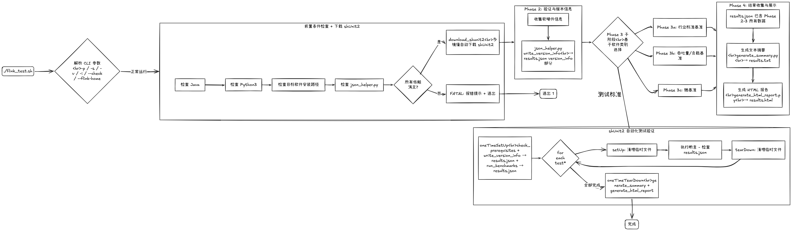

# ARM64 Performance Benchmark — 通用流程手册

> 本手册描述如何在 ARM64 (aarch64) 架构上对开源软件进行系统性性能基准测试。涵盖从前置条件检查到结果输出的完整流程，适用于所有类型的项目（数据库、数据处理、KV 存储、消息队列等）。目标软件 (Java/Python/软件本体) 必须预先安装，脚本仅做检查和报错提示。**shUnit2 会自动下载**（多镜像回退）。

---

## 目录

1. [项目总览](#1-项目总览)
2. [整体流程图](#2-整体流程图)
3. [前置条件检查](#3-前置条件检查)
4. [Phase 2：验证与版本信息收集](#4-phase-2验证与版本信息收集)
5. [Phase 3：基准测试执行](#5-phase-3基准测试执行)
6. [Phase 4：结果收集与展示](#6-phase-4结果收集与展示)
7. [shUnit2 测试验证体系](#7-shunit2-测试验证体系)
8. [CLI 参数与使用方式](#8-cli-参数与使用方式)
9. [关键编码规则](#9-关键编码规则)
10. [各软件实例对照](#10-各软件实例对照)

---

## 1. 项目总览

### 目标

在 ARM64 平台上对开源软件进行 **工业标准级** 性能基准测试，产出可复现、可对比、可归档的量化结果。整个流程由前置条件检查 + shUnit2 自动化测试验证构成，所有依赖必须预先安装。

### 项目文件结构

每个软件的基准测试项目遵循统一的目录结构：

```
<software>/                          # 项目根目录，以软件名命名
├── <software>_test.sh               # shUnit2 测试套件 — 单一入口脚本
├── shunit2                          # shUnit2 框架 (自动下载，多镜像回退)
└── scripts/                         # 辅助脚本
│   ├── json_helper.py               # JSON 解析 CLI 工具 (10+ 命令)
│   ├── benchmark_<bench1>.py/sh     # 主基准测试 (如 TPC-DS, YCSB)
│   ├── benchmark_<bench2>.py/sh     # 次基准测试 (如 吞吐量, Streaming)
│   ├── micro_benchmark.py/sh        # 微基准 (单操作延迟/吞吐)
│   ├── generate_summary.py          # 文本摘要生成
│   └── generate_html_report.py      # HTML 报告 (纯 CSS + inline SVG)
└── results/                         # 执行结果 (由测试脚本创建)
    ├── results.json                 # 聚合基准数据 + 环境信息
    ├── results.txt                  # 关键指标摘要 + pass/fail
    ├── results.html                 # 可视化报告 (CSS + SVG)
    └── results.log                  # [TAG] message 全流程日志
```

### 前置条件 (必须预先安装)

| 依赖 | 说明 | 安装提示 |
|------|------|---------|
| Java JDK | 17+ (Flink 等Java项目) | `sudo apt-get install temurin-17-jdk` |
| Python 3 | 3.8+ | 系统包管理器安装 |
| 目标软件 | 具体版本 | 下载解压到项目目录，或设置 `<SOFTWARE>_HOME` |
| shUnit2 | Shell 单元测试框架 | **自动下载** (curl/wget 多镜像回退) |

> 目标软件 (Java, Python, 软件本体) 不自动下载或安装，缺失时输出详细安装提示并退出。shUnit2 是唯一自动下载的依赖。

---

## 2. 整体流程图



---

## 3. 前置条件检查

脚本启动时首先执行 `check_prerequisites()`，检查目标软件依赖。**不做下载或安装**，缺失依赖时输出详细安装提示并退出。shUnit2 不在此函数中检查，而是通过 `download_shunit2()` 自动下载。

### 3.1 检查清单

| 检查项 | 检查方式 | 缺失时的提示 |
|--------|---------|-------------|
| Java | `command -v java` | 推荐 Temurin JDK 安装命令 |
| Python3 | `command -v python3` | 要求安装 Python 3.8+ |
| 目标软件 | `[ -d ${HOME} ] && [ -x ${HOME}/bin/<binary> ]` | 下载地址 + `*_HOME` 环境变量提示 |
| json_helper.py | `[ -f scripts/json_helper.py ]` | 提示此文件是必需的 |

> shUnit2 通过 `download_shunit2()` 自动下载，不在 `check_prerequisites()` 中检查。

### 3.2 shUnit2 自动下载

`download_shunit2()` 在 `main()` 中调用，多镜像回退下载 shUnit2：

```bash
# 镜像列表
https://raw.githubusercontent.com/kward/shunit2/master/shunit2     # GitHub 官方
https://mirrors.aliyun.com/github-raw/kward/shunit2/master/shunit2 # 阿里云
https://raw.gitmirror.com/kward/shunit2/master/shunit2             # gitmirror

# 下载流程
curl 通道 → 失败 → wget 通道 → 失败 → 报错提示手动安装
# 下载后验证: grep "^SHUNIT_VERSION=" 确认文件完整
```

如果 `${SCRIPT_DIR}/shunit2` 已存在，跳过下载。

### 3.3 错误输出格式

```bash
[ERROR] Flink is not installed at /path/to/flink-2.0.0
[ERROR]   Please download Flink 2.0.0 and extract to /path/to/project/
[ERROR]   Download: https://archive.apache.org/dist/flink/flink-2.0.0/flink-2.0.0-bin-scala_2.12.tgz
[ERROR]   Or set FLINK_HOME to point to your Flink installation directory
[FATAL] Prerequisites not met. Use --check for detailed status.
```

---

## 4. Phase 2：验证与版本信息收集

Phase 2 确认软件可用，并收集完整的软硬件环境信息作为测试报告的元数据。

### 4.1 基础功能验证

通过 `test*` 函数在 shUnit2 中验证，不在 Phase 2 中单独执行。

### 4.2 收集版本信息

**动作**：收集软硬件属性，通过 `json_helper.py write_version_info` 写入 `results.json` 的 `version_info` 部分。

**必收集字段**：

| 字段 | 来源 | 说明 |
|------|------|------|
| `timestamp` | `date -u` | UTC 时间戳 |
| `architecture` | `uname -m` | aarch64/arm64 |
| `kernel` | `uname -r` | 内核版本 |
| `os` | `/etc/os-release` | 操作系统版本 |
| `cpu_model` | `/proc/cpuinfo` | CPU 型号 |
| `cores` | `nproc` | CPU 核数 |
| `memory_mb` | `free -m` | 内存容量 |
| `software` | 用户参数 | 软件名称 |
| `version` | 用户参数 | 软件版本 |
| `java_version` | `java -version` | Java 版本 |
| `install_path` | 安装路径 | 软件位置 |
| `installed` | 目录检查 | 是否安装 (1/0) |
| `parallelism` | 用户参数 | 并行度 |

> **控制字符清洗**：所有 shell 变量传入 `json_helper.py` 前必须 `tr -d '\n\t'`。

**[项目差异]**：
| 软件 | 额外字段 |
|------|---------|
| Flink | `scala_version`, `flink_home`, `task_slots`, `parallelism` |
| Redis | `gcc_version` |
| RocksDB | `arm64_crc32c`, `neon_asimd_support`, `jemalloc_enabled` |

---

## 5. Phase 3：基准测试执行

Phase 3 根据软件类别分为多个子阶段 (3a/3b/3c)，每个子阶段将结果直接写入 `results.json`，不产生独立的中间 JSON 文件。

### 5.1 子阶段选择矩阵

| 软件类别 | Phase 3a | Phase 3b | Phase 3c |
|----------|----------|----------|----------|
| **数据处理** (Flink, Spark) | TPC-DS/TPC-H SQL | Streaming 吞吐/延迟 | 微操作 (sort/join/state) |
| **KV 存储** (Redis, RocksDB) | YCSB | 吞吐量 (多操作×多并发) | 微基准 (单命令延迟) |
| **消息队列** (Kafka, Pulsar) | 吞吐/延迟 | End-to-end 延迟 | 持久化基准 |
| **Web 服务** (Nginx, Envoy) | RPS 并发测试 | 延迟百分位 | SSL/TLS 吞吐 |
| **RPC 框架** (CloudWeGo, gRPC) | RPC 吞吐 | HTTP 吞吐 | 序列化性能 |
| **容器编排** (K8s, Docker) | Pod 启动延迟 | API 响应性 | 调度吞吐 |

### 5.2 基准测试 JSON 标准格式

每个 benchmark JSON 必须遵循此结构：

```json
{
  "benchmark": "<benchmark_name>",
  "description": "What this test measures",
  "reference": "Industry source or project name",
  "software": "<SOFTWARE_NAME>",
  "version": "<VERSION>",
  "architecture": "arm64",
  "timestamp": "...",
  "performance_metrics": {
    "<metric_name>": {
      "unit": "<unit>",
      "description": "<what this metric means>"
    }
  },
  "dataset_info": {
    "name": "<dataset>",
    "size": "<size>",
    "source": "<where data comes from>"
  },
  "results": [ ... ]
}
```

---

## 6. Phase 4：结果收集与展示

Phase 4 基于 `results.json`（Phase 2-3 数据已直接写入其中）生成文本摘要、HTML 报告和确认日志完整性，在 `oneTimeTearDown()` 中执行。

### 6.1 生成文本摘要

`generate_summary.py` 读取 `results.json`，输出 `results.txt`。

### 6.2 生成 HTML 报告

`generate_html_report.py` 读取 `results.json`，生成 `results.html`，包含纯 CSS 图表 + inline SVG + 数据表 + 环境信息 + metrics 卡片 + shUnit2 测试结果摘要。

### 6.3 结果文件规格

| 文件 | 格式 | 内容 | 用途 |
|------|------|------|------|
| `results/results.json` | JSON | 聚合基准数据, 环境信息 | 程序化访问 |
| `results/results.txt` | 文本 | 关键指标摘要, pass/fail | CI/CD 集成 |
| `results/results.html` | HTML | 可视化报告 (CSS + SVG) | 归档, 分享 |
| `results/results.log` | 日志 | `[TAG] message` 全流程日志 | 调试 |

---

## 7. shUnit2 测试验证体系

shUnit2 是整个基准测试流程的**质量保障层**。`<software>_test.sh` 是单一入口 shUnit2 测试套件。

### 7.1 测试生命周期

```
oneTimeSetUp()       ← check_prerequisites + collect_version_info → results.json + run_benchmarks → results.json
  ↓
for each test*():    ← shUnit2 自动发现
  setUp()            ← 清理临时文件
  testXxx()          ← 断言验证 (检查 results.json 中的数据)
  tearDown()         ← 清理临时文件
  ↓
oneTimeTearDown()    ← generate_summary → results.txt + generate_html_report → results.html
```

| 函数 | 调用时机 | 用途 |
|------|---------|------|
| `oneTimeSetUp` | 测试开始前 | 检查前置条件, 收集版本信息写入 results.json, 运行基准测试写入 results.json |
| `setUp` | 每个 test 前 | 清理临时文件 |
| `tearDown` | 每个 test 后 | 清理临时文件 |
| `oneTimeTearDown` | 测试结束后 | 生成 results.txt + results.html |

### 7.2 测试项分类

#### Phase 2 验证测试

| 测试函数 | 含义 |
|---------|------|
| `testArchitectureIsARM64` | 架构是 aarch64/arm64 |
| `testSoftwareIsInstalled` | 软件已安装 (`startSkipping` 如果未安装) |
| `testResultsJsonExists` | results.json 存在 |
| `testResultsJsonHasVersionInfo` | results.json 包含 version_info 部分 |
| `testResultsJsonHasArchitecture` | results.json version_info 有 architecture 字段 |
| `testResultsJsonHasSoftwareVersion` | results.json version_info 有 version 字段 |

#### Phase 3a 主基准测试

| 测试函数 | 含义 |
|---------|------|
| `testBenchmarkPrimaryInResultsJson` | results.json 包含主基准数据 |
| `testBenchmarkPrimaryHasRequiredFields` | 主基准有 benchmark/metrics/results 字段 |
| `testBenchmarkPrimaryThroughputAboveThreshold` | 吞吐量 >= 阈值 (`[DIAG]` 输出) |

#### Phase 3b 次基准测试

| 测试函数 | 含义 |
|---------|------|
| `testBenchmarkSecondaryInResultsJson` | results.json 包含次基准数据 |
| `testBenchmarkSecondaryThroughputAboveThreshold` | 吞吐量 >= 阈值 |
| `testBenchmarkSecondaryLatencyBelowThreshold` | 延迟 <= 阈值 |

#### Phase 3c 微基准测试

| 测试函数 | 含义 |
|---------|------|
| `testBenchmarkMicroInResultsJson` | results.json 包含微基准数据 |
| `testBenchmarkMicroAllOperationsCompleted` | 结果数 > 0 |

#### Phase 4 报告测试

| 测试函数 | 含义 |
|---------|------|
| `testResultsJsonContainsAllBenchmarks` | results.json 包含所有基准关键词 |
| `testHtmlReportGenerated` | results.html 存在 |
| `testSummaryReportGenerated` | results.txt 存在 |
| `testLogFileGenerated` | results.log 存在 |

### 7.3 json_helper.py 断言桥梁

shUnit2 无法直接解析 JSON，`json_helper.py` 作为 CLI 桥梁：

| 命令 | 用途 | shUnit2 用法 |
|------|------|-------------|
| `get <keys>` | 获取嵌套值 | `assertEquals` |
| `field_exists <key>` | 字段存在 (返回 1/0) | `assertTrue "[ $(...) -eq 1 ]"` |
| `count_results` | results 数组长度 | `assertTrue "[ $(...) -gt 0 ]"` |
| `throughput_ge <threshold> <keys>` | 值 >= 阈值 (返回 1/0) | `assertTrue` |
| `latency_le <threshold> <keys>` | 值 <= 阈值 (返回 1/0) | `assertTrue` |
| `avg_throughput <keys>` | 平均吞吐 | 诊断输出 |
| `max_latency <keys>` | 最大延迟 | 诊断输出 |
| `version` | 软件版本 | `assertEquals` |
| `contains <keyword>` | JSON 含关键词 | `assertTrue` |
| `write_version_info <args>` | 写入 version_info 到 results.json | Phase 2 调用 |

Shell 包装函数模式：
```bash
json_get()              { python3 "${JSON_HELPER}" "$1" get "${@:2}"; }
json_throughput_ge()    { python3 "${JSON_HELPER}" "$1" throughput_ge "$2" "${@:3}"; }
json_latency_le()       { python3 "${JSON_HELPER}" "$1" latency_le "$2" "${@:3}"; }
json_avg_throughput()   { python3 "${JSON_HELPER}" "$1" avg_throughput "${@:2}"; }
json_max_latency()      { python3 "${JSON_HELPER}" "$1" max_latency "${@:2}"; }
```

### 7.4 startSkipping 机制

前置数据缺失时使用 `startSkipping` 标记 SKIP (不是 FAIL)：

```bash
testSoftwareIsInstalled() {
    local found=0
    if [ -d "${FLINK_HOME}" ] && [ -x "${FLINK_HOME}/bin/flink" ]; then found=1; fi
    if [ "${found}" -eq 0 ]; then
        echo "WARNING: Flink not installed, skipping install check"
        startSkipping
        return
    fi
    assertTrue "Flink binary should exist" "[ ${found} -eq 1 ]"
}
```

---

## 8. CLI 参数与使用方式

### 8.1 通用 CLI 参数

| 参数 | 长选项 | 默认值 | 说明 |
|------|--------|--------|------|
| `-p` | `--phases` | `1,2,3,4` | 指定执行的 Phase |
| `-s` | `--software-version` | 软件特定 | 目标软件版本 |
| `--flink-home` | — | `${SCRIPT_DIR}/flink-<VERSION>` | 软件安装路径 |
| `-v` | `--data-scale` | 1 | 数据规模因子 |
| `-i` | `--iterations` | 3 | 迭代次数 |
| `--parallelism` | — | 4 | 并行度 |
| `--check` | — | (flag) | 仅检查前置条件 |
| `-h` | `--help` | (flag) | 显示帮助 |

### 8.2 使用示例

```bash
# 检查前置条件
./flink_test.sh --check

# 全流程运行
./flink_test.sh

# 仅运行特定 Phase
./flink_test.sh -p 3a,3b

# 自定义安装路径
./flink_test.sh --flink-home /opt/flink-2.0.0

# 自定义参数
./flink_test.sh -i 5 -v 10

# 指定版本
./flink_test.sh -s 1.20.0
```

### 8.3 环境变量

| 变量 | 说明 | 示例 |
|------|------|------|
| `VERSION` | 默认软件版本 | `VERSION=1.20.0 ./flink_test.sh` |
| `FLINK_HOME` | 软件安装路径 | `FLINK_HOME=/opt/flink ./flink_test.sh` |
| `ITERATIONS` | 迭代次数 | `ITERATIONS=5 ./flink_test.sh` |
| `DATA_SCALE` | 数据规模 | `DATA_SCALE=10 ./flink_test.sh` |
| `PARALLELISM` | 并行度 | `PARALLELISM=8 ./flink_test.sh` |
| `PHASES` | 执行的 Phase | `PHASES=3a,3b ./flink_test.sh` |

---

## 9. 关键编码规则

违反这些规则会导致已知 bug 模式：

### 规则 1：禁止 shell 内嵌多行 Python

**`python3 -c "..."` 在 shell 中严禁使用多行版本**。Shell 双引号与 Python 字符串冲突。所有 Python 逻辑放入 `scripts/` 目录的独立 `.py` 文件。

### 规则 2：验证 Python 语法

**所有 `.py` 文件必须通过 `py_compile` 检查**。常见问题：括号不匹配、f-string 闭合错误、引号冲突。

### 规则 3：检查 python3 可用性 — 不自动安装或创建 venv

脚本检查 `command -v python3`，缺失时报错退出。如需 Python 包，检查是否可导入：
```bash
python3 -c "import numpy" 2>/dev/null || log "WARN" "numpy not available"
```

### 规则 4：不下载目标软件 — 仅检查前置条件；shUnit2 自动下载

目标软件 (Java, Python, 软件本体) 必须由用户预先安装。脚本检查并输出安装提示。shUnit2 是唯一通过 `download_shunit2()` 自动下载的依赖。

### 规则 5：禁止 shell heredoc 写 JSON

**`cat << EOFJSON` 严禁用于生成 JSON**。Shell 变量可能含控制字符，导致 `JSONDecodeError`。使用 `json_helper.py write_version_info` 写入 `results.json`。

所有 shell 变量传入 JSON 前必须 `tr -d '\n\t'` 清洗控制字符。

### 规则 6：Shell 包装函数使用 `${@:2}` / `${@:3}`

JSON 路径可以是任意深度。硬编码 `"$3" "$4"` 只传 2 个 key，深层路径被截断返回 `NULL`。

```bash
json_throughput_ge()    { python3 "${JSON_HELPER}" "$1" throughput_ge "$2" "${@:3}"; }
json_avg_throughput()   { python3 "${JSON_HELPER}" "$1" avg_throughput "${@:2}"; }
```

### 规则 7：JSON 路径与实际结构一致

断言中的 JSON 路径必须与 benchmark 脚本实际输出的结构匹配。

### 规则 8：`testSoftwareIsInstalled` 使用 `startSkipping`

软件未安装时使用 `startSkipping`，不是硬断言 `assertTrue`。

```bash
testSoftwareIsInstalled() {
    local found=0
    if [ -d "${HOME}" ] && [ -x "${HOME}/bin/<binary>" ]; then found=1; fi
    if [ "${found}" -eq 0 ]; then
        echo "WARNING: <software> not installed, skipping"
        startSkipping
        return
    fi
    assertTrue "Binary should exist" "[ ${found} -eq 1 ]"
}
```

### 规则 9：sed 使用 `|` 或 `#` 分隔符

替换含 `/` 的路径时，`sed "s|...|path|"` 避免 `/` 冲突。

### 规则 10：验证脚本不 `exit 1`

检查项失败只输出 WARNING，继续执行和写入 version_info。

### 规则 11：默认参数设为快速验证值

`ITERATIONS=1`, 数据量小, 阈值宽松。生产运行通过 CLI 参数覆盖。

### 规则 12：每个阈值测试含 `[DIAG]` 输出

```bash
echo "[DIAG] TPC-DS avg throughput: ${avg_throughput} ops/sec (threshold: ${MINIMUM_TPCDS_THROUGHPUT})"
```

### 规则 13：shUnit2 测试套件禁止 `set -euo pipefail`

shUnit2 管理自己的错误处理。`set -euo pipefail` 会破坏 shUnit2 的断言机制。仅在辅助脚本中使用。

### 规则 14：`SHUNIT_PARENT` 必须设置

```bash
SHUNIT_PARENT="${SCRIPT_DIR}/${SOFTWARE_NAME}_test.sh"
```

### 规则 15：shUnit2 自动下载 — 多镜像回退

`download_shunit2()` 从 GitHub raw 镜像 (github.com, aliyun, gitmirror) 下载 shUnit2，curl 先 → wget 回退 → 验证 `SHUNIT_VERSION=`。已存在则跳过下载。

---

## 10. 各软件实例对照

### 10.1 测试项数量对照

| 软件 | Phase 2 测试 | Phase 3a 测试 | Phase 3b 测试 | Phase 3c 测试 | Phase 4 测试 | 总计 |
|------|-------------|-------------|-------------|-------------|-------------|------|
| Flink | 6 | 3 | 3 | 2 | 4 | 18 |
| Redis | 5 | 3 | 3 | 2 | 4 | 17 |
| RocksDB | 5 | 3 | 3 | 3 | 4 | 18 |

### 10.2 Phase 3 子阶段对照

| 软件 | 3a | 3b | 3c |
|------|----|----|----|
| Flink | TPC-DS | Streaming | Micro |
| Redis | YCSB | Throughput | Micro |
| RocksDB | YCSB | db_bench | Micro |

### 10.3 运行时依赖对照

| 软件 | 运行时 | 特殊配置 |
|------|--------|---------|
| Flink | JDK 17+ (Temurin) | FLINK_HOME 环境变量 |
| Redis | 无 (C 编译) | 需预先编译 |
| RocksDB | 无 (C++ 编译) | USE_JEMALLOC=1, ARM64 优化编译 |

### 10.4 阈值默认值参考

| 软件 | 吞吐量阈值 | 延迟阈值 |
|------|-----------|---------|
| Flink TPC-DS | >= 500 ops/sec | — |
| Flink Streaming | >= 10K events/sec | <= 500ms |
| Redis YCSB | >= 1000 ops/sec | p99 <= 50ms |
| RocksDB YCSB-A | >= 100 ops/sec | — |

> 阈值是宽松验证值，确保在任何 ARM64 硬件上都能通过。

---

## 附录：快速参考

### A. 一键执行命令

```bash
# 检查前置条件
./<software>_test.sh --check

# 全流程运行
./<software>_test.sh

# 仅运行特定 Phase
./<software>_test.sh -p 3a,3b

# 自定义安装路径
./<software>_test.sh --flink-home /opt/flink-2.0.0
```

### B. shUnit2 自动下载

脚本运行时会自动下载 shUnit2。如果自动下载失败，可手动安装：
```bash
curl -L https://raw.githubusercontent.com/kward/shunit2/master/shunit2 \
    -o /path/to/<software>/shunit2 && chmod +x /path/to/<software>/shunit2
```

### C. 质量检查清单

生成项目前，验证以下 28 项：

1. `<software>_test.sh` 存在、可执行、是 shUnit2 测试套件
2. `SHUNIT_PARENT` 已设置
3. 无 `set -euo pipefail` (Rule 13)
4. `oneTimeSetUp` 运行 check_prerequisites + write_version_info → results.json + run_benchmarks → results.json
5. `oneTimeTearDown` 运行 generate_summary + generate_html_report
6. 所有 `test*` 函数可被 shUnit2 自动发现
7. `json_helper.py` 在 `scripts/` 目录
8. JSON 包装函数使用 `"${@:2}"` / `"${@:3}"` (Rule 6)
9. `testSoftwareIsInstalled` 使用 `startSkipping` (Rule 8)
10. 每个阈值测试有 `[DIAG]` 输出 (Rule 12)
11. 目录结构：`<software>/`, `scripts/`, `results/`
12. 结果文件：仅 `results.json`, `results.txt`, `results.html`, `results.log` (无中间阶段独立文件)
13. 日志格式：`[TAG] message` → `results/results.log`
14. `check_prerequisites()` 检查 Java, Python, 目标软件, json_helper.py (不检查 shUnit2)
15. shUnit2 通过 `download_shunit2()` 自动下载 (多镜像回退)；目标软件不下载
16. `testArchitectureIsARM64` 断言架构
17. `--check` CLI 选项
18. JSON 数据由 Python 脚本直接写入 results.json (非 shell heredoc, 无中间阶段文件)
19. Shell 变量清洗 `tr -d '\n\t'`
20. `sed` 使用 `|` 或 `#` 分隔符
21. 验证脚本不 `exit 1` (使用 `startSkipping`)
22. 默认参数为快速验证值
23. 所有 `.py` 通过 `py_compile`
24. 所有 `.sh` 通过 `bash -n`
25. `.sh` 文件 `chmod +x`
26. results.json 包含 version_info + 所有 benchmark 数据 (无中间阶段独立 JSON 文件)
27. HTML 报告使用纯 CSS + inline SVG (无外部 JS)
28. HTML 报告包含 shUnit2 测试结果摘要